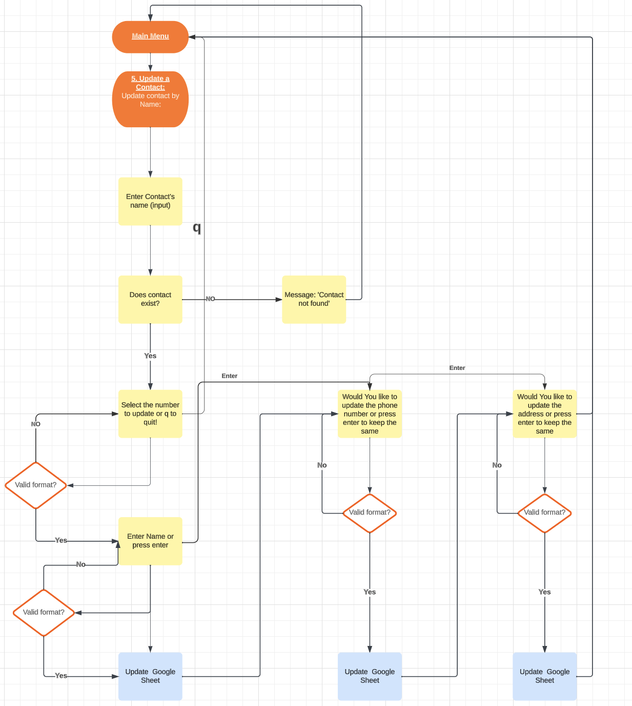
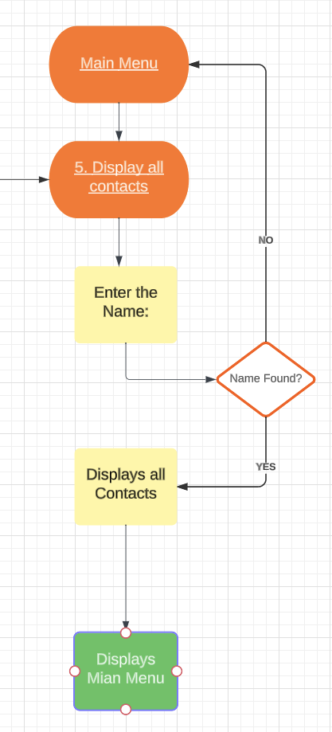

# Project Name - Address-Manager
 

## View Live Project
* [Link to Deployed Project](https://python-address-manager-0aa938ee9c82.herokuapp.com/)

## Contents
* [User Experience (UX)](#user-experience)
    *  [Purpose & target audience](#purpose-and-target-audience)
    *  [User Story](#user-story)
    *  [Goals](#goals)
* [Design](#design)
* [Planned features](#planned-features)
* [Validation](#validation)
* [Technology](#technology)
* [Modules & Libraries](#modules--libraries)
* [Deployment](#deployment)
* [Testing](#testing)
  * [Bugs resolved](#bugs-resolved)
  * [Unresolved bugs](#unresolved-bugs)
  * [Improvements & future developments](#improvements-and-future-developments)
* [Forking & Cloning Instructions](#forking--cloning-instructions)
* [Credits](#credits)
  * [Code](#code)
  * [Content](#content)
  * [Acknowledgements](#acknowledgements)

## User Experience

### Purpose and Target Audience
   * Address Manager is a simple contacts storing system, safely backed up and updated to a google worksheet.
   * The app is made for everyone in Germany to add, find, update and view contacts information, including name, contact number and address.
   * For the contact number in adding a contact function, the country code (+49) used is for Germany only.

### User Story
   * The user is presented with an attractive intuitive command-line admin portal, navigating through various menu choices.
   * The user can choose to add a contact.
   * The user can choose to find a contact.
   * The user can choose to update a contact.
   * The user can choose to delete a contact.
   * The user can choose to view contacts in the app.
   * The user can find contact by name (first, last or full name).
   * The app will display all the contacts with similar name (first, last or full name) with all information included.
   * The user is notified when the information has been updated after each action.
   * The user is notified in case of an invalid character/data entered, and will prompt the user to enter the information correctly.

### Goals
   * The app must be simple and clear to use by anyone, with very little or no training required.
   * The data displayed should be relevant to each menu item selected.
   * The program should find, update, add or delete the given input from a Google worksheet via API calls.
   * The user should easily be able to exit a menu.
   * The user must be well informed if an entry or selection is invalid.

## Design
* The design is a simple terminal application that uses Python as the building language.  The Code Institute mock terminal template was used.

* The initial concept and the logic behind the program's menu was created using Lucid chart.
* Only desktop was considered.  The mock terminal is not suitable for mobile.

### Logic Flow chart  created with [Lucid Chart](https://www.lucidchart.com/)
 
Main Menu 
 
 
 
 
Add a Contact Menu Flow and Logic
 
 
 
 
Find a Contact Flow and Logic
 
 
 
 
Update Contact Flow and Logic
 
 
 
 
Delete Contact Flow and Logic
 
  
 
 
Display Contacts Flow and Logic
 
 
 
 

### Main Background
   * The app uses no background image
  
### Terminal Colors
   * In the terminal multiple font colors were chosen:
   * White for Menu items and headers
   * Green for successfully getting the results from the user query
    
    
    
   * Purple for displaying results from the user queries such as: contact information, updated contact information.
    
    
    
    
   * Red for errors
    
    
    
   

### Typography
   * The main text font is the default font in the command line terminal.

### MVP
   * A simple yet fully functionable app was created to add, find, update, delete and display contacts to anyone who looks for a contact in the system 
   * It also checks for any invalid errors and handles them according for the program to keep running wihtout causing any problem to the user.

### Planned features
   * The initial plan was to have a simple address manager with options to add, find, update, delete and display contacts.
   * The added information is then stored in google sheet via an API call.

## Validation
* Various validation messages were used to ensure that the user was notified correctly of any incorrect input and to ensure the program would not crash.
 
 

## Technology
* The following tools and technologies were used to complete this project:
* [Lucid](https://www.lucidchart.com/) - logic chart
* [Google Cloud Service Accounts & API](https://cloud.google.com)
* Python - terminal application
* GitHub - version control
* GitPod - IDE
* [Heroku](https://www.heroku.com/)
* [PEP-8 Validator](https://pep8ci.herokuapp.com/)

## Modules & Libraries
* The following libraries were imported to run the application:
* gspread - for Google worksheet API
* ASCI - for displaying fontin different colors
* Re module- for data validation 

## Deployment
* The following steps were taken to deploy this site:
* The project was initially set up in GitHub using Code Institute's project template
* A Google worksheet was created to store the data
* An API was setup through [Google Cloud](https://cloud.google.com)
* A JSON key was created from the Service Account and copied into the repo as creds.json
* The creds.json file was added to git ignore
* The email address in the creds.json file was shared with the Google Worksheet
* gspread was installed by typing "pip3 install gspread google-auth" in the terminal
* The live site was deployed to Heroku early on so the final UX could be experienced early and often, using the following steps:
* [Login to Heroku (create an account if needed)](https://id.heroku.com/login)
* Create New App - choosing a unique name
* Under Settings / Config Vars enter the PORT in the KEY section as 8000
* Add buildpacks: Python and then Node.js - in that order
* Under Deploy - select GitHub and link to repo name
* Under Manual Deployment, click Deploy Branch

## Testing
* Extensive testing was carried out on the site which are as follows:
* PEP-8
  - After the code was written out, each line was tested if there existed any errors in the problems termind in gitpod
  - all the errors related to syntax and indentations were resolved leaving the code empty of any errors.
 
 
   

* after all the errors were mitigated, the code was passed through a PEP8 validtor and passed.
 
 
   

* User Stories Testing
 
 
   

### Bugs resolved:
  * User input errors that would make the program crash.
  * Making sure the main menu is displayed once the user is done with a particular section.
  * These errors were resolved through the usage of while loops and try and except statements.
  * Google sheet not updating as expecting, this was resolved by fixing the errors in the respective method being called.

### Unresolved bugs:
  * None

### Improvements and Future Developments:
  * Currently the program only caters to Germany when entering contact number, it can be made for several country codes with number of characters.
  * The app could also have a working login system so each member can access only their address list and update it accordingly.
  * Additional input fields can be added to take more information for the contact being stored for example: links to their social media accounts, birth-date, work-phone-number(if any).

## Forking & Cloning Instructions
* To create a copy of the repo in GitHub to edit:
1. Log in to your GitHub account.
2. Navigate to [address_manager repository](https://github.com/)
3. Click on the "Fork" button located in the upper right-hand corner of the repository's page.
4. Select the account where you want to fork the repository.
5. Wait for GitHub to complete the forking process.
6. Open the project in GitPod (or whichever IDE you have setup)

* To clone a copy of the repo on your local machine to edit:
1. Log in to your GitHub account.
2. Navigate to [address_manager](https://github.com/)
3. Click on the "Code" button located in the upper right-hand corner of the repository's page.
4. Click on the "HTTPS" link to copy the URL of the repository.
5. Open the terminal or command prompt on your local machine and navigate to the directory where you want to clone the repository.
6. Type the following command, replacing the "repository_URL" with the URL of the repository that you copied in step 4: git clone repository_URL.
7. Press Enter and wait for the cloning process to complete.

## Credits:
### Code
  * All the code was written and developed entirely for this project.
  * YouTube Videos, Stack Overflow, Google Search and ChatGPT were used to clarify functions, PEP-8 requirements and docstring formats

### Content
### Acknowledgements
  * Medale Oluwafemi for your mentorship.
  * Code Institute's Love Sandwiches project for the Google API
  * Inspiration from  [rstan-dev](https://github.com/rstan-dev) for the readme.md file and project idea
  * Inspiration from  [BekBrace](https://github.com/BekBrace) for project idea
  